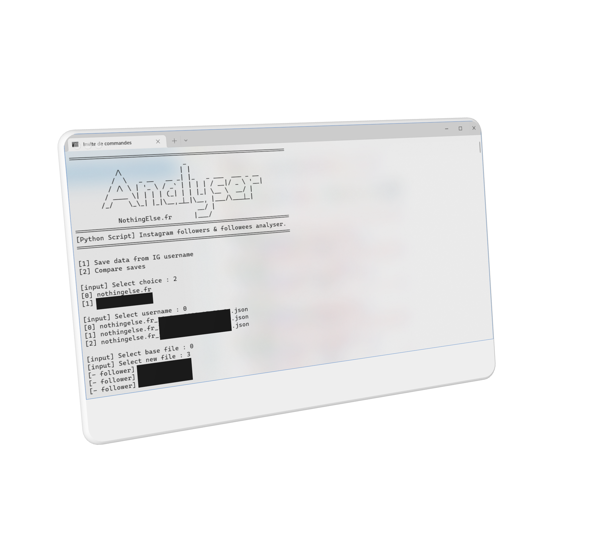

# Instagram-Followers-Analyzer
 
<p align="center">
    
</p>

- ## Description :
  
  This script dowload dataset of followers and followees of an instagram username.
  And you can compare two data set of same username to see who are new follower or who unfollow etc...

- ## Requirements :
  
  - Python 3
  - Instagram account

- ## Install :
  
  - Instaloader lib : `pip install instaloader`

- ## Config :

  - Change credentials :
    ```py
        L.login("USERNAME", "PASSWORD")
    ```